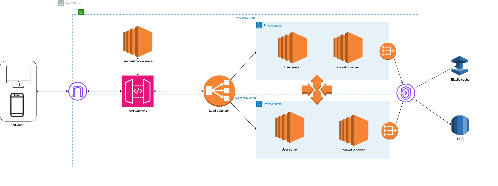
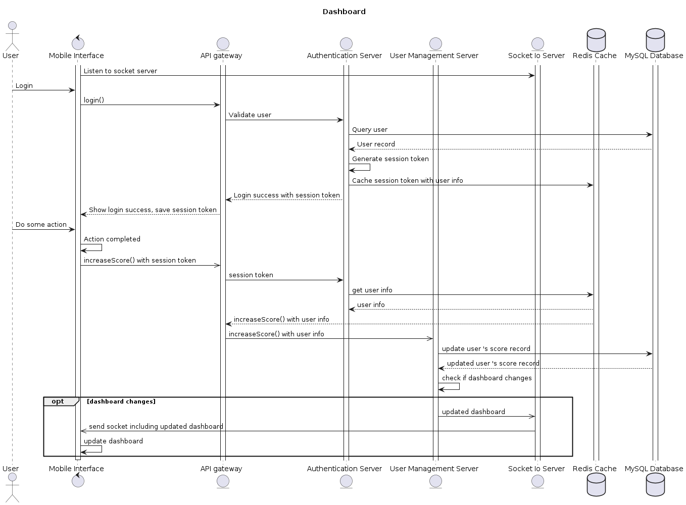

# Problem 6

## Requirement Analysis

1. The score board need to be live updated, this means we need to open socket from server to client to send updated scores.
In the case when there is not much concurrent customer, we can design the server following monolithic architecture, then we must have one module to handle the the socket connection.
In case when there is a lot of concurrent customer and we want to scale the module that handle the socket connection independently

2. The malicious users need to be authorized to increase the score, that means the system requires user to provide session token to validate the action.

## System architecture diagram

In this section I will assume that the company is using AWS and follow the microservices architecture. Below is the architecture of the system.

## Sequence diagram

In this part, I assume that the application has many concurrent users and is following the microservices architecture. Below is the sequence diagram that stimulates its workflow.

If the dashboard happens much more frequently than the score being updated then we may consider cache the dashboard result after each time there is change in the dashboard when after the increaseScore() function is completed.
